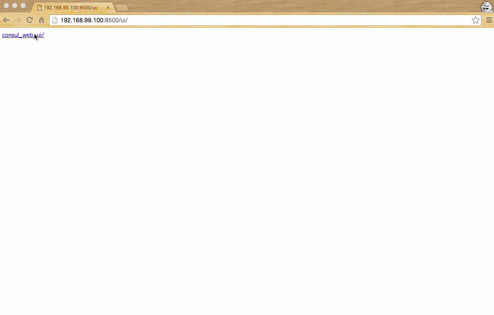

# Create Consul Cluster on Docker

[consul](https://www.consul.io) on [docker](https://www.docker.com/)

## Start

build

```
docker-compose build
```

up

```
docker-compose up
```

## Login to container

ex) login to server2

```
docker exec -it $(docker ps -q -f name=server2) bash
```

## Check members

ex) show members of server1 cluster

```
docker exec -it $(docker ps -q -f name=server1) consul members
```

## Join cluster

ex) add server3 to server1 cluster

```
docker exec -it $(docker ps -q -f name=server3) consul join c3d_server1.docker
```

## Exec command to All members

ex) exec command via server2

```
docker exec -it $(docker ps -q -f name=server2) consul exec cat /etc/redhat-release
```

## Consul Web UI

check your docker-machine ip address

```
docker-machine ip <docker-machine name>
```

open url -> http://<your docker-machine ip address>:8500/ui/



## DNS

use DNS for two-way access of container each other

see [tonistiigi/dnsdock](https://github.com/tonistiigi/dnsdock)

## TODO

- [ ] Add Consul Web UI
- [ ] Add Service
